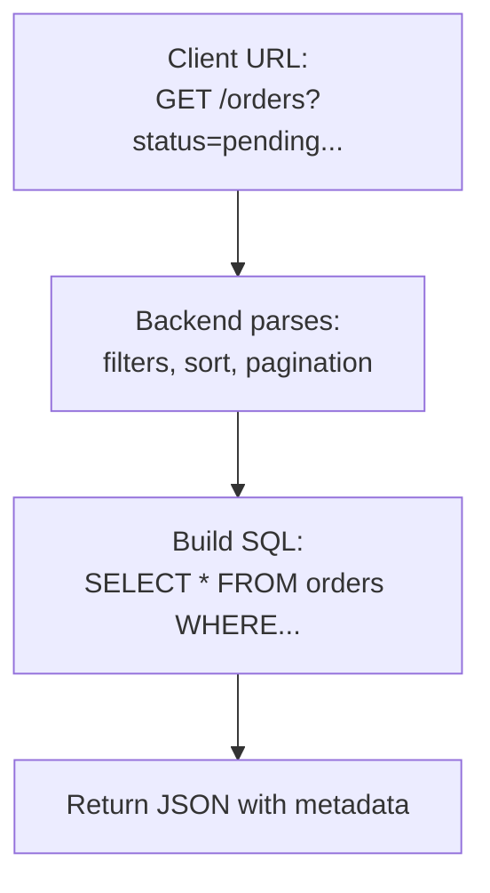
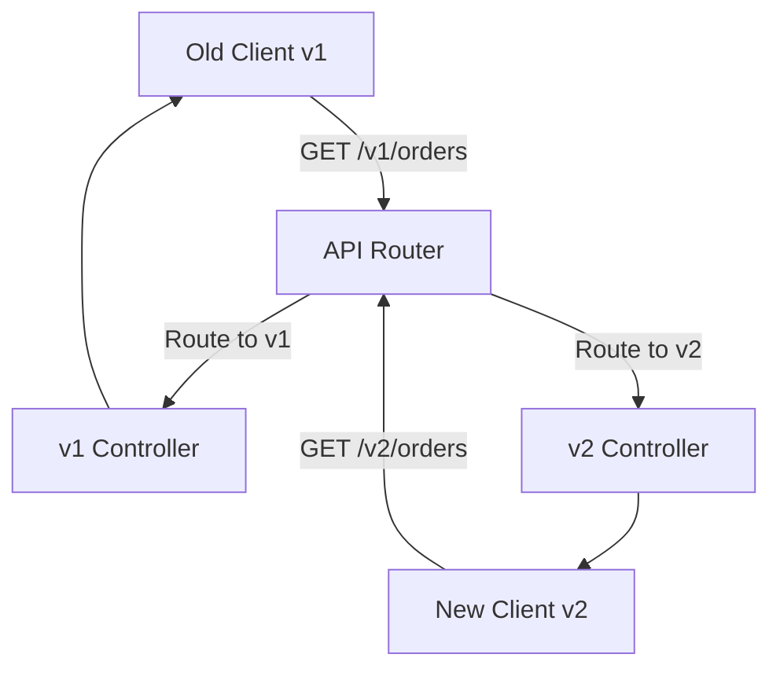

# Day 5: Professional API Design
*(Deep dive: naming conventions, pagination, filtering, sorting, versioning – from first principles, production-grade, with tradeoffs)*

***

## SECTION 1: INTUITION

Imagine you’re building a **library catalog API**.

You want to:
- List all books.
- Search by title, author, category.
- Show results page by page (not 100,000 books at once).
- Let users sort by relevance, date, rating.
- Evolve the API over time without breaking existing clients.

This is exactly what **professional API design** is about:
- **Naming:** clear, consistent, predictable URLs.
- **Pagination:** handle large datasets without blowing up memory or latency.
- **Filtering:** support searches like “books by author X” or “order status = pending”.
- **Sorting:** support `?sort=created_at&order=desc`.
- **Versioning:** change API safely as product grows.

> [!TIP]
> **Hinglish intuition:**  
> “API ek public contract hai. Ek baar contract publish kiya, aur 1000 clients use karna start karein, toh koi bhi change = breaking change ho sakta hai.  
> Toh hum design karte hain jisse:
> - easy to use ho,
> - scalable ho,
> - aur baad mein change bhi kar sakein without panic.”

***

## SECTION 2: THEORY – CORE CONCEPTS

### 2.1 Why “Professional” API Design Matters

Early-stage startups often write **quick, messy APIs**:
- `/getAllUsers`
- `/getUserById`
- No pagination
- No consistent error format
- No versioning

This works for a few internal endpoints. But when:
- You have **external clients** (mobile apps, partners),
- You need to **scale** to thousands of requests/sec,
- You want to **change** behavior without breaking clients,

then you need **professional API design**.

**Key goals:**
1. **Consistency** – predictable patterns across all endpoints.
2. **Discoverability** – easy for developers to understand.
3. **Efficiency** – no wasteful data, no huge payloads.
4. **Evolvability** – can change without breaking existing clients.

***

### 2.2 Naming Conventions

#### 2.2.1 Use Resource-Oriented Names (Nouns, Not Verbs)

RESTful APIs use **nouns** for resources:
- **Good**: `/users`, `/orders`, `/products`
- **Bad**: `/getUsers`, `/createOrder`, `/deleteProductById`

**Why?**
- HTTP methods are verbs (`GET`, `POST`, `DELETE`).  
- The URL should be the **resource** (noun).  
- This makes API design **uniform** and **intuitive**.

> **Rule:**  
> **URL = path to a resource (noun).**  
> **Method = action (verb).**

#### 2.2.2 Use Plural Nouns for Collections

**Consistency:**
- `/users` (not `/user` or `/usersList`)
- `/orders`
- `/posts`

**Why plural?**
- Clear that it’s a **collection**.
- `GET /users` → list of users.
- `POST /users` → create a new user.

#### 2.2.3 Use Hierarchical Paths for Relationships

For related resources:
- `/users/{userId}/orders` → List all orders for a specific user.
- `/orders/{orderId}/items` → List items in an order.

This is **natural hierarchy**:
```text
/users/{id}          → single user
/users/{id}/orders   → user’s orders
/orders/{id}/items   → items in an order
```

**Avoid:** `/getOrdersForUser?id=123` (too RPC-like).

#### 2.2.4 Use Lowercase, Hyphen-Cased Paths

**Best practice:**
- Paths: lowercase, hyphens for readability.
- Examples: `/user-profiles`, `/order-items`, `/product-categories`

**Avoid:**
- `/userProfiles` (camelCase in path is confusing).
- `/User_Profiles` (mixed casing).

*(Note: Some companies use underscores, but hyphens are more common in web APIs.)*

#### 2.2.5 Use Consistent Suffixes (Optional)

Some teams use:
- `/api/v1/users`
- `/api/v2/users`

or simply:
- `/v1/users`
- `/v2/users`

*(We’ll cover versioning in detail later.)*

***

### 2.3 Pagination

#### Why Pagination Exists

If you have 10M users and do:
```http
GET /users
```
Default behavior without pagination:
- Returns **all** users in one response.
- **Problems:** Huge JSON (100MB+), slow DB query, high memory usage, network latency.

**Pagination** = split large result sets into smaller chunks (pages).

#### 2.3.1 Common Pagination Strategies

**A. Offset-Based Pagination (Most Common)**
Client sends:
- `page`: which page number.
- `limit`: how many items per page.

```http
GET /orders?page=1&limit=20
```
- **Pros:** Simple, intuitive.
- **Cons:** “Page skipping” if new items are added. “Deep pagination” is slow on large tables (`OFFSET 999990 LIMIT 20`).
- **Use when:** Data is not extremely large, and perfectly stable pagination isn't required.

**B. Cursor-Based Pagination (Better for Real-Time / Large Data)**
Client sends:
- `cursor`: a pointer to the last item on the previous page.
- `limit`: how many items.

```http
GET /orders?cursor=abc123&limit=20
```
- **Pros:** No deep offset problem. Pagination is stable.
- **Cons:** Slightly more complex. Cannot jump directly to “page 100”.
- **Use when:** Large datasets, real-time feeds (e.g., social timelines).

**C. Keyset Pagination (Special Form of Cursor)**
Similar to cursor, but uses a **stable key**, like `created_at` + `id`.

```http
GET /orders?created_at_after=2026-06-01T12:00:00Z&limit=20
```
- **Pros:** Stable, highly efficient with proper indexes.
- **Cons:** Requires ordered fields.

#### 2.3.2 Pagination Response Format

Two common styles:

**Style 1: Include metadata at top level**
```json
{
  "data": [ ... ],
  "pagination": {
    "total": 10000,
    "page": 1,
    "limit": 20,
    "total_pages": 500
  }
}
```

**Style 2: Include pagination links (RESTful)**
```json
{
  "data": [ ... ],
  "links": {
    "self": "https://api.example.com/orders?page=1&limit=20",
    "next": "https://api.example.com/orders?page=2&limit=20",
    "prev": null
  }
}
```
> **Rule:** Pick one style and **use consistently** across all endpoints.

***

### 2.4 Filtering

#### Why Filtering Exists

Clients often want specific slices of data:
- “Show me orders with status = pending.”
- “Show me products in category = shoes.”

**Filtering** = reduce result set based on query parameters.

#### 2.4.1 Simple Filters (Equality)
```http
GET /orders?status=pending&customer_id=123
```
SQL equivalent:
```sql
SELECT * FROM orders WHERE status = 'pending' AND customer_id = 123;
```

#### 2.4.2 Range Filters
```http
GET /products?min_price=500&max_price=2000
GET /orders?created_after=2026-06-01&created_before=2026-06-10
```

#### 2.4.3 Text Search / Partial Match
```http
GET /users?name=john
```
SQL equivalent:
```sql
SELECT * FROM users WHERE name ILIKE 'john%';
```
*(Warning: Wildcard searches can be slow. Add indexes and limit result sizes.)*

#### 2.4.4 Multiple Filters Combined
```http
GET /orders?status=pending&customer_id=123&min_total=100
```
> **Rule:** Each filter parameter = one condition in SQL (combined with `AND`). Use `OR` only when clearly documented.

#### 2.4.5 Filtering vs Pagination
Often used together:
```http
GET /orders?status=pending&page=1&limit=20
```
SQL:
```sql
SELECT * FROM orders
WHERE status = 'pending'
ORDER BY created_at DESC
OFFSET 0 LIMIT 20;
```

***

### 2.5 Sorting

#### Why Sorting Exists
Clients often want “Newest first” or “Cheapest first”. Sorting allows you to order results by one or more fields.

#### 2.5.1 Basic Sorting Pattern
```http
GET /users?sort=created_at&order=desc
```

#### 2.5.2 Multiple Fields
```http
GET /products?sort=price,created_at&order=asc,desc
```

#### 2.5.3 Default Sorting
Always define defaults. If no sort params, use `?sort=created_at&order=desc` for most collections. Document this in API docs.

#### 2.5.4 Sorting + Pagination + Filtering
```http
GET /orders?status=pending&sort=created_at&order=desc&page=1&limit=20
```

***

### 2.6 Versioning

#### Why Versioning Exists
APIs evolve: you add new fields, change structures, or break old behaviors. But clients (mobile apps, partners) may not update immediately.

**Versioning** allows multiple versions of the same API to coexist safely.

#### 2.6.1 URL-Based Versioning (Most Common)
```http
GET /v1/users
GET /v2/users
```
- **Pros:** Clear, simple, easy to debug, browser-accessible.
- **Cons:** More URLs to manage, version in URL isn't purely RESTful.

#### 2.6.2 Header-Based Versioning
```http
GET /users
Accept-Version: v1
```
- **Pros:** Cleaner URLs, more RESTful.
- **Cons:** Less visible in browser, harder to debug.

#### 2.6.3 Strategy for Evolving APIs
- **v1**: initial API.
- **v2**: add features, change structure, but keep v1 alive.
- **Migration:** Document changes, announce a deprecation timeline, and set an end-of-life date for v1.

> **Rule:** Never break a version without notice. Always support at least one previous version for a while.

***

## SECTION 3: VISUAL DIAGRAMS

### Diagram 1: Pagination + Filtering + Sorting URL



***

### Diagram 2: API Versioning Flow



***

## SECTION 4: PRODUCTION EXAMPLES

### Example 1: BigTech-style Pagination (Cursor-Based)
E-commerce product listings (infinite scroll):
```http
GET /products?cursor=xyz123&limit=24
```
Response:
```json
{
  "data": [...],
  "next_cursor": "abc456"
}
```

### Example 2: Startup-style Pagination (Offset-Based)
Social media posts:
```http
GET /posts?page=2&limit=10&sort=created_at&order=desc
```
Response:
```json
{
  "data": [...],
  "pagination": {
    "total": 500,
    "page": 2,
    "limit": 10,
    "total_pages": 50
  }
}
```

### Example 3: Filtering & Sorting
Food delivery app:
```http
GET /restaurants?category=biryani&min_rating=4&sort=rating&order=desc
```

### Example 4: API Versioning
Auth API:
```http
GET /v1/auth/token  // returns { token: string }
GET /v2/auth/token  // returns { access_token, refresh_token, expires_at }
```

***

## SECTION 5: BACKEND IMPLEMENTATION

Let’s build a **professional-style API** for `orders`. Focus on `GET /v1/orders`.

### Request Parsing (Node.js + Express)

```js
app.get('/v1/orders', async (req, res) => {
  const {
    status,
    min_total,
    sort = 'created_at',
    order = 'desc',
    page = 1,
    limit = 20
  } = req.query;

  // Validate page/limit
  const pageNum = Math.max(1, parseInt(page, 10));
  const limitNum = Math.max(1, parseInt(limit, 10));
  const offset = (pageNum - 1) * limitNum;

  // Build query conditions
  const conditions = [];
  const values = [];

  if (status) {
    conditions.push('status = $1');
    values.push(status);
  }
  if (min_total) {
    conditions.push('total >= $1');
    values.push(parseFloat(min_total));
  }

  const whereClause = conditions.length ? `WHERE ${conditions.join(' AND ')}` : '';

  // SQL
  const sql = `
    SELECT * FROM orders
    ${whereClause}
    ORDER BY ${sort} ${order}
    OFFSET ${offset} LIMIT ${limitNum}
  `;

  const rows = await db.query(sql, values);

  res.json({
    data: rows,
    pagination: {
      page: pageNum,
      limit: limitNum,
      total: rows.length // Simplified
    }
  });
});
```

**Key points:**
- Query params for filters, sort, pagination.
- Use defaults for `sort`, `order`, `page`, `limit`.
- Validate and sanitize inputs.

***

## SECTION 6: COMMON MISTAKES

1. **Inconsistent naming:** `/getUser`, `/get_users`. (Fix: use `/users`).
2. **No pagination:** Huge payloads. (Fix: always paginate collections).
3. **Using `page` and `offset` together:** Confusing. (Fix: use `page` + `limit` or cursor-based).
4. **Not validating sort/order:** Allowing arbitrary column names opens up SQL injection risk. (Fix: validate against allowed fields).
5. **Mixing versioning styles:** Some endpoints use `/v1/`, some use header. (Fix: pick one style and stick to it).
6. **Over-filtering in URL:** Too many params create long URLs. (Fix: use grouping or JSON bodies for complex filters).
7. **Returning raw DB errors:** Leaks internals. (Fix: implement global error handling).

***

## SECTION 7: INTERVIEW QUESTIONS

1. Why do we use **plural nouns** in REST endpoints?  
2. What is the difference between **offset-based** and **cursor-based** pagination? When would you use each?  
3. How would you implement filtering by status and range (min/max price) in SQL?  
4. How do you handle **sorting** safely without allowing arbitrary column injection?  
5. Why is API **versioning** important? Give examples of breaking changes.  
6. What are the tradeoffs of **URL-based** vs **header-based** versioning?  
7. How would you design an API for a feed (messages, notifications) with pagination?  
8. Show an example of a well-designed URL for listing orders with filters, sorting, and pagination.  
9. Why is consistency in API design important for large teams?  
10. What is a “deep pagination” problem, and how do you solve it?

***

## SECTION 8: REVISION NOTES (CHEAT SHEET)

- **Naming**: Use plural nouns (`/users`). Use hyphens (`/order-items`). Use hierarchy (`/users/{id}/orders`).
- **Pagination**: 
  - Offset: `page`, `limit` (Simple).
  - Cursor: `cursor`, `limit` (Stable, scalable). Always paginate collections.
- **Filtering**: Use query params (`?status=pending`). Map to SQL `WHERE`.
- **Sorting**: `?sort=created_at&order=desc`. Always validate fields.
- **Versioning**: URL (`/v1/users`) or Header (`Accept-Version`). Never break old versions without notice.

***

## SECTION 9: HANDS-ON ASSIGNMENT

Design a **professional REST API** for `products` with:
- Pagination (offset-based).
- Filtering by `category`, `min_price`, `max_price`, `in_stock`.
- Sorting by `price`, `created_at`, `rating`.
- Versioning: `/v1/products`, `/v2/products`.

**Tasks:**
1. Write the full URL for: List products in category “shoes”, price 500–2000, sorted by price asc, page 2, 20 per page.
2. Write the SQL for that query.
3. Define response JSON with pagination metadata.

***

## SECTION 10: MINI PROJECT

Implement `GET /v1/products` with:
- Pagination (page, limit).
- Filters: `category`, `min_price`, `max_price`.
- Sorting: `sort`, `order`.

*(Use in-memory data or a simple DB to test the implementation.)*

***

## ACTIVE LEARNING – YOUR TURN

Design the full URL for:

> “List orders with status = pending, total >= 100, sorted by created_at descending, page 3, 50 per page.”

Then write the corresponding SQL query (with `WHERE`, `ORDER BY`, `OFFSET`, `LIMIT`).
